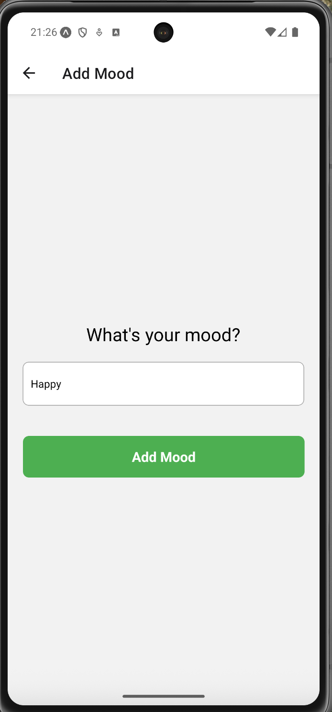
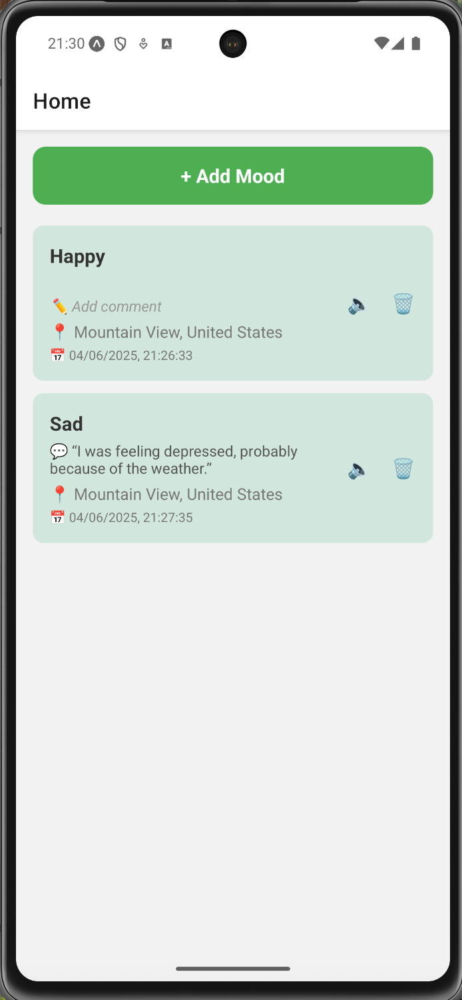
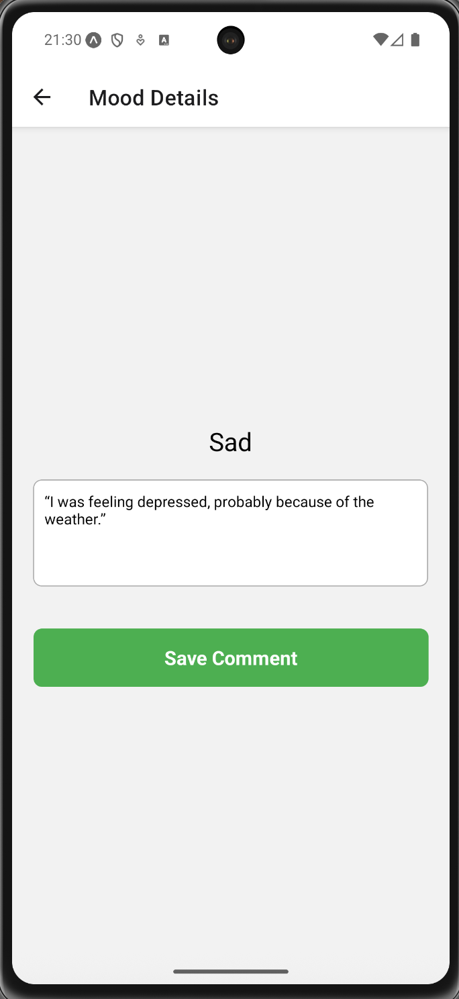

# 🧠 Mood Tracker App

Aplikacja do zapisywania nastrojów, komentarzy i lokalizacji.

---

## ✅ Funkcjonalności

- Dodawanie nowego nastroju z lokalizacją
- Edycja komentarza do istniejącego nastroju
- Usuwanie nastroju z listy
- Odczyt lokalizacji (reverse geocoding)
- Odczyt komentarza na głos (Text-to-Speech)
- Obsługa błędów za pomocą Error Boundary
- Zapis danych offline w AsyncStorage

---

## ⚙️ Technologie

- React Native (Expo)
- AsyncStorage
- expo-location
- expo-speech

---

## 🚀 Jak uruchomić

1. Zainstaluj zależności:
   ```bash
   npm install


   ```

## 📱 Screeny aplikacji

### ➕ Ekran dodawania nastroju

> Umożliwia wpisanie nowego nastroju oraz automatyczne pobranie lokalizacji.



---

### 🏠 Ekran główny

> Wyświetla listę zapisanych nastrojów z komentarzami, lokalizacją i datą.



---

### ✏️ Ekran szczegółów nastroju

> Pozwala dodać lub edytować komentarz do wybranego nastroju.


